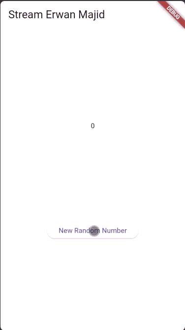
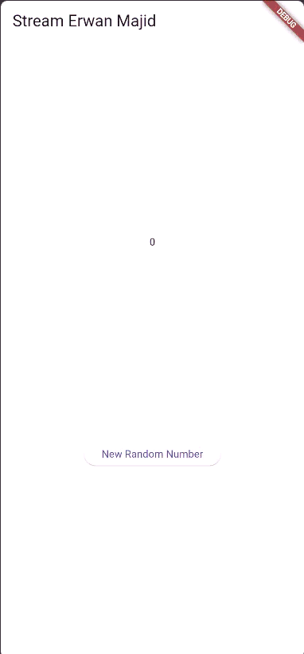
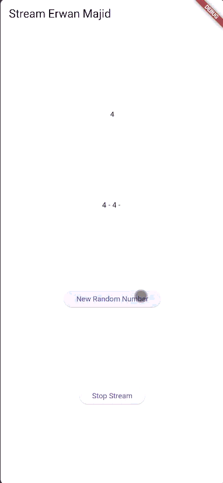

# Lab 1: Dart Streams

## Question 1

Add your nickname to title the app as an identity for your work.

Change the application theme color according to your preference.

```.dart:
Widget build(BuildContext context) {
    return MaterialApp(
      title: 'Stream-Erwan Majid',
      theme: ThemeData(primarySwatch: Colors.brown[100]),
      home: const StreamHomePage(),
    );
  }
```

## Question 2

Add 5 more colors as you wish to colors the variable

```.dart:
  final List<Color> colors = [
  Colors.blueGrey,
  Colors.amber,
  Colors.deepPurple,
  Colors.lightBlue,
  Colors.teal,

 Colors.red,
  Colors.green,
  Colors.orange,
  Colors.pink,
  Colors.indigo,
];
```

## Question 3

- Explain the function of the keyword yield \* in the code!

Answer : The keyword yield* is used inside an async* function to forward or pass through all values that come from another stream into the current stream. Instead of yielding one value at a time, yield* connects an entire stream so that every event produced by that stream automatically becomes part of the output of your own stream. In simple terms, yield* tells Dart: “take everything from this other stream and send it out through my stream.

- What does the code command mean?

Answer :
The code

```.dart:
    yield* Stream.periodic(
  const Duration(seconds: 1), (int t) {
    int index = t % colors.length;
    return colors[index];
  });
```

creates a stream that produces one color every second by repeatedly calculating an index based on time t, looping through the color list using modulo, and returning a color at each tick. The yield\* in front of this periodic stream means that your getColors() function will output every color generated by the periodic stream, making the function continuously emit different colors every second

## Question 4

Capture your practical results in GIF format and attach them to the README.


## Question 5

Result:


- Explain the difference between using listen and await for(step 9)!

Asnwer :
The difference between listen and await for is that listen() reacts to stream events using a callback without waiting, so the app continues running normally while updating the UI whenever new data arrives. Meanwhile, await for waits for each stream event inside a loop, meaning the function pauses until the next value comes, although the UI still stays responsive. In short, listen is event-based and does not wait, while await for is loop-based and waits for events sequentially

# Lab 2: Stream controllers and sinks

## Question 6

- Explain the meaning of the code steps 8 and 10!

  In Step 8, the initState() method initializes the necessary components for working with a stream of numbers. First, it creates an instance of NumberStream, which manages the stream. Then, it retrieves the StreamController from the NumberStream object, which is used to add data to the stream and control the stream's lifecycle. The stream itself is obtained from the controller, and a listener is added using stream.listen(). This listener waits for new events (numbers) that are added to the stream. Whenever a new number is received, the setState() method is called to update the lastNumber value, causing the UI to refresh and display the latest number.

  In Step 10, the addRandomNumber() method generates a random number using Dart’s Random class. It creates a random integer between 0 and 9 by calling random.nextInt(10). This random number is then passed to the stream using numberStream.addNumberToSink(myNum), which adds the number to the stream’s controller. As a result, the number is sent to the stream, and the listener from Step 8 receives the event, which triggers the UI to update and display the new number.

  In summary, Step 8 connects the UI to the stream, so whenever a new number is added, the UI updates. Step 10 generates a random number and sends it to the stream, which the listener in Step 8 then processes and updates the display.

- Capture your practical results in GIF format and attach them to the README



## Question 7

- Explain the meaning of the code steps 13 to 15!

Step 13

```.dart:
void addError() {
    controller.sink.addError('error');
  }
```

The addError() method is used to send an error into the stream. The line controller.sink.addError('error') sends an error event with the message 'error' into the stream. This means that any listener subscribed to the stream will receive this error and can respond accordingly, such as displaying an error message or updating the UI.

Step 14

```.dart:
.onError((error) {
  setState(() {
    lastNumber = -1;
  });
});

```

The .onError() method is used to handle errors coming from the stream. When an error is received, the callback function inside onError is triggered. In this case, when an error occurs, lastNumber is set to -1, which likely serves as an indicator that an error has happened or that no valid data has been received.

step 15

```.dart:
void addRandomNumber() {
  Random random = Random();
  //int myNum = random.nextInt(10);
  //numberStream.addNumberToSink(myNum);
  numberStream.addError();
}
```

The addRandomNumber() method is normally used to generate a random number and add it to the stream. However, in this case, the code that generates the random number has been commented out, and instead the method calls numberStream.addError(). This means that when the button or action triggering addRandomNumber() is executed, it no longer sends a random number but instead sends an error to the stream using addError()

- Return the code to its original state in Step 15, comment addError()it so you can proceed to the next practical 3

```.dart:
void addRandomNumber() {
    Random random = Random();
    int myNum = random.nextInt(10);
    numberStream.addNumberToSink(myNum);
    //numberStream.addError();
  }
```

# Lab 3: Injecting data into streams

## Question 8

- Explain the meaning of the code steps 1-3!

Step 1 – Creating the StreamTransformer

In this step, a StreamTransformer is created to modify the incoming data. Every value is multiplied by 10, and if an error occurs, the transformer sends -1 instead. This prepares the data before it reaches the listener

Step 2 – Applying the Transformer to the Stream

Next, the original stream is connected to the transformer using .transform(transformer). This means all incoming data will be processed by the transformer before being passed to the listener.

Step 3 – Listening to the Transformed Stream

Finally, the listener receives the transformed data. Each new value updates the UI through setState(), and if an error happens, the listener sets the displayed value to -1 as an error indicator

- Capture your practical results in GIF format and attach them to the README.

  

# Lab 4: Multiple stream subscriptions

## Question 9

- Explain the meaning of the code steps 2, 6 and 8!

Step 2 – initState()

In this step, the stream and its controller are initialized. NumberStream is created, its controller is accessed, and stream.listen() starts listening for new numbers from the stream. When a number is received, setState() updates the UI with the new value.

Step 6 – dispose()

The subscription.cancel() in dispose() stops the stream listener when the page is closed. This prevents the app from continuing to listen to the stream and avoids memory leaks.

Step 8 – addRandomNumber()

In this step, a random number is generated and added to the stream if the stream is not closed. If the controller is closed, it does not send the number and shows -1 as an error indicator.

# Lab 5: Multiple stream subscriptions

## Question 10

- Explain why this error could occur?

The error message "Bad state: Stream has already been listened to" occurs when a stream has been listened to more than once without using the correct approach, because a stream can only be listened to by one listener at a time.

## Question 11



- Explain why this could happen?

When the button is pressed, two numbers appear because the same stream is being listened to by two different listeners. Each listener reacts to the new event coming from the stream, so when a single number is added, Listener 1 updates the “lastNumber” text, and Listener 2 appends the same number to the “values” text. Since both listeners receive the same event at the same time, it looks like two numbers are produced, but actually one number is sent and processed twice by two listeners
