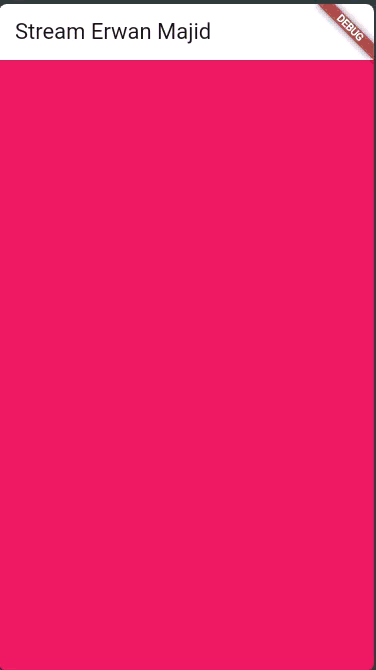

# Lab 1: Dart Streams

## Question 1

Add your nickname to title the app as an identity for your work.

Change the application theme color according to your preference.

```.dart:
Widget build(BuildContext context) {
    return MaterialApp(
      title: 'Stream-Erwan Majid',
      theme: ThemeData(primarySwatch: Colors.brown[100]),
      home: const StreamHomePage(),
    );
  }
```

## Question 2

Add 5 more colors as you wish to colors the variable

```.dart:
  final List<Color> colors = [
  Colors.blueGrey,
  Colors.amber,
  Colors.deepPurple,
  Colors.lightBlue,
  Colors.teal,

 Colors.red,
  Colors.green,
  Colors.orange,
  Colors.pink,
  Colors.indigo,
];
```

## Question 3

- Explain the function of the keyword yield \* in the code!

Answer : The keyword yield* is used inside an async* function to forward or pass through all values that come from another stream into the current stream. Instead of yielding one value at a time, yield* connects an entire stream so that every event produced by that stream automatically becomes part of the output of your own stream. In simple terms, yield* tells Dart: “take everything from this other stream and send it out through my stream.

- What does the code command mean?

Answer :
The code

```.dart:
    yield* Stream.periodic(
  const Duration(seconds: 1), (int t) {
    int index = t % colors.length;
    return colors[index];
  });
```

creates a stream that produces one color every second by repeatedly calculating an index based on time t, looping through the color list using modulo, and returning a color at each tick. The yield\* in front of this periodic stream means that your getColors() function will output every color generated by the periodic stream, making the function continuously emit different colors every second

## Question 4

Capture your practical results in GIF format and attach them to the README.


